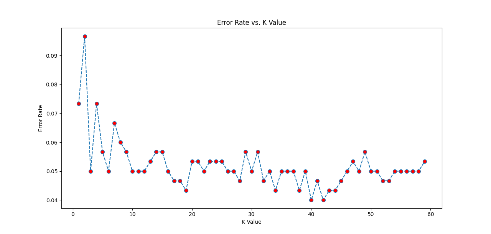
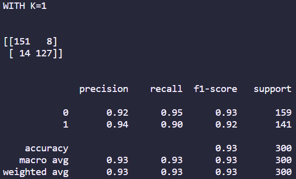

# K Nearest Neighbors: Predicting Target Class for Classified Data

## Description

In this project I used KNN to train a model and then optimized the k value by using the elbow method to improve my model. The technologies used were:

- python 
- sklearn
- pandas
- numpy
- matplotlib

One thing I learnt in this challenge is that increasing k value also increases the computational intensity so you have to find a k value that balances the trade off between increasing accuracy and increasing computational power. Since the dataset wasn't that big I choose k = 40 for the highest accuracy (error rate = 0.04) but I could have gone for k = 19 (error rate = 0.043) which had only a 0.003 increased error rate but way less computational intensity. 

## Installation

To install this project you will have to download the repository from github and runit locally from your CLI. To be able to use this project python will have to be installed, which can be found [here](https://www.python.org/downloads/).

## Usage

Once installed you can use this project by entering the repository location using your CLI. Once entered into the repository you can run the project by entering the following in the CLI:

1. Creating a virtual environment: ```python -m venv .venv```
2. Activating the virtual environment: ```source .venv/Scripts/activate```
3. Downloading all the required packages: ```pip install -r requirements.txt```
4. Running the file: ```python KNN.py```

Once run graphs, confusion matrices and classification reports will show up, similar to these examples below:


